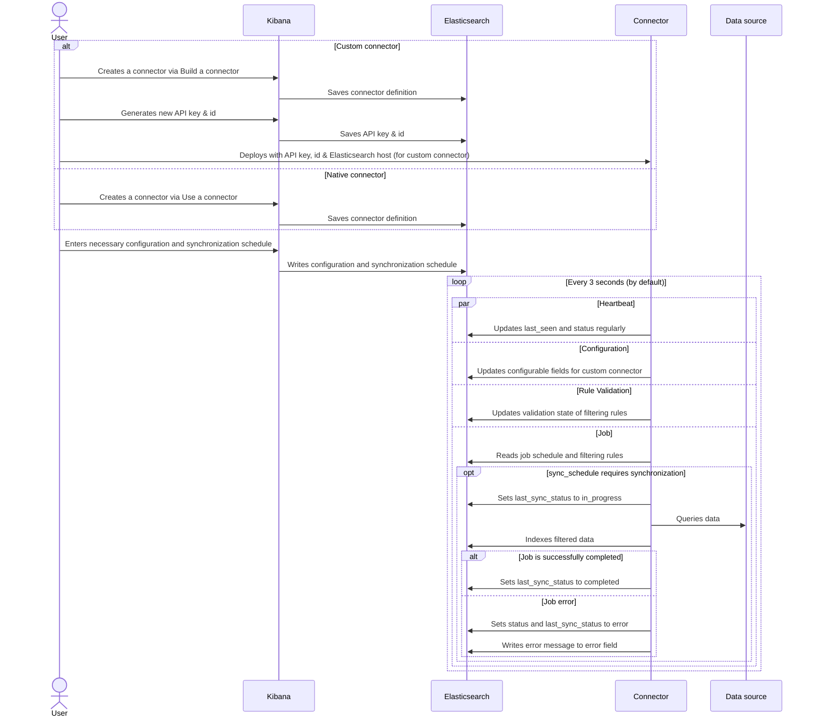

# Connector Protocol

To enable Elasticsearch users to ingest any kind of data and build a search experience on top of that data, we are providing a lightweight protocol that will allow users to easily ingest data, use Enterprise Search features to manipulate that data and create a search experience, while providing them with a seamless user experience in Kibana. To be compatible with Enterprise Search and take full advantage of the connector features available in Kibana, a connector should adhere to the protocol defined here.

## Main tenets

### Architecture
- All communication between connectors and other parts of the system happen asynchronously through an Elasticsearch index
- We want to minimize the number of indices we use to manage the system. Elasticsearch is not a relational database but a document store, and we want to optimize for that architecture.
- Users must be able to easily manage their search-related indices and connectors in Kibana
- The system must be robust and able to deal with unexpected downtime and crashes.

### Connectors

Connectors can:
- Ship large amounts of data to an Elasticsearch index independently.
- communicate their status to Elasticsearch and Kibana so that users can provide it with configuration and diagnose any issues.
- Handle early termination and crashes well .

At this stage, our assumption is that one connector will manage one index, and one index will have only one connector associated with it. This may change in the future.

### Data freshness

Data from remote sources are synced via [sync jobs](DEVELOPING.md#syncing), which means there can be data discrepancy between the remote source and Elasticsearch until the next sync job runs.

There are some data sources with streaming option (E.g. [Change Streams](https://www.mongodb.com/docs/manual/changeStreams) for MongoDB, [Change notifications](https://learn.microsoft.com/en-us/graph/webhooks) for Sharepoint), which allows external systems to capture changes in real-time. This option has been evaluated, and will not in our roadmap in the near future.

In order to maintain (near) real-time data availability, [implement incremental sync](DEVELOPING.md#how-an-incremental-sync-works) for the data source, with a frequency that matches your needs.

Kibana won't allow you to configure a schedule more frequently than every hour, but you can do so via the Elasticsearch API (through Kibana Dev Tools, or cURL, etc):

```
# Update to every 5 seconds
POST /.elastic-connectors/_update/<_id>
{
  "doc": {
    "scheduling": {
      "incremental": {
        "interval": "0/5 * * * * ?"
      }
    }
  }
}
```

## Communication protocol

All communication will need to go through Elasticsearch. We've created a connector index called `.elastic-connectors`, where a document represents a connector. In addition, there's a connector job index called `.elastic-connectors-sync-jobs`, which holds the job history. You can find the definitions for these indices in the next section.

### Index definition

#### Connector index `.elastic-connectors`

This is our main communication index, used to communicate the connector's configuration, status and other related data. All dates in UTC.
```
{
  api_key_id: string;   -> ID of the current API key in use
  configuration: {
    [key]: {
      default_value: any;   -> The value used if `value` is empty (only for non-required fields)
      depends_on: [         -> Array of dependencies, field will not be validated unless dependencies are met
        field: string;      -> The key for the field that this will depend on
        value: string | number | boolean;   -> The value required to have this dependency met
      ];
      display: string;      -> What UI element this field should use
      label: string;        -> The label to be displayed for the field in Kibana
      options: [                -> Array of options for list-type fields, used for Kibana inputs
        label: string;          -> Option label for UI element
        value: string | number; -> Option value for UI element
      ];
      order: number;        -> The order the configurable field will appear in the UI
      required: boolean;    -> Whether or not the field needs a value
      sensitive: boolean;   -> Whether or not to obfuscate the field in Kibana
      tooltip: string;      -> Text for populating the Kibana tooltip element
      type: string;         -> The field value type (str, int, bool, list)
      ui_restrictions: string[];    -> List of places in the UI to restrict the field to
      validations: [                         -> Array of rules to validate the field's value against
        type: string;                        -> The validation type
        constraint: string | number | list;  -> The rule to use for this validation
      ];
      value: any;           -> The value of the field configured in Kibana
    }
  };                    -> Definition and values of configurable
                           fields
  custom_scheduling: {
    [key]: {
      configuration_overrides: {
        [key]: {
          label: string     -> The label to be displayed for the field in Kibana
          value: string,    -> The value of the field configured in Kibana
        }
      };                    -> Configurable fields to be overridden when custom schedule runs
      enabled: boolean;     -> Whether job schedule is enabled
      interval: string;     -> Quartz Cron syntax
      last_synced: string;  -> Date/time of last job (UTC)
      name: string;         -> The name of the custom schedule
    }
  };                        -> Schedules with custom configurations
  description: string;  -> The description of the connector
  error: string;        -> Optional error message
  features: {
    [feature_name]: {
        [subfeature_name]: {
            enabled: boolean; -> Whether this feature is enabled
        }
    };                                  -> Features to enable/disable for this connector
  };
  filtering: [          -> Array of filtering rules, connectors use the first entry by default
    {
      domain: string,     -> what data domain these rules apply to
      active: {           -> "active" rules are run in jobs.
        rules: {
          id: string,         -> rule identifier
          policy: string,     -> one of ["include", "exclude"]
          field: string,      -> the field on the document this rule applies to
          rule: string,       -> one of ["regex", "starts_with", "ends_with", "contains", "equals", "<", ">"]
          value: string,      -> paired with the `rule`, this `value` either matches the contents of the document's `field` or does not
          order: number,      -> the order in which to match rules. The first rule to match has its `policy` applied
          created_at: string, -> when the rule was added
          updated_at: string  -> when the rule was last edited
        },
        advanced_snippet: {   -> used for filtering data from the 3rd party at query time
          value: object,      -> this JSON object is passed directly to the connector
          created_at: string, -> when this JSON object was created
          updated_at: string  -> when this JSON object was last edited
        },
        validation: {
          state: string,      -> one of ["edited", "valid", "invalid"]
          errors: {
            ids: string,      -> the id(s) of any rules that are deemed invalid
            messages: string  -> the message(s) to display in Kibana, explaining what is invalid
          }
        }
      },
      draft: object;      -> Identical to the above "active" object, but used when drafting edits to filtering rules
    }
  ];
  index_name: string;   -> The name of the content index where data will be written to
  is_native: boolean;   -> Whether this is a native connector
  language: string;     -> the language used for the analyzer
  last_access_control_sync_error: string;   -> Optional last access control sync job error message
  last_access_control_sync_scheduled_at: date;    -> Date/time when the last access control sync job is scheduled (UTC)
  last_access_control_sync_status: string:  -> Status of the last access control sync job, or null if no job has been executed
  last_deleted_document_count: number;    -> How many documents were deleted in the last job
  last_incremental_sync_scheduled_at: date; -> Date/time when the last incremental sync job is scheduled (UTC)
  last_indexed_document_count: number;    -> How many documents were indexed in the last job
  last_seen: date;      -> Connector writes check-in date-time regularly (UTC)
  last_sync_error: string;   -> Optional last full or incremental sync job error message
  last_sync_status: string;  -> Status of the last content sync job, or null if no job has been executed
  last_permissions_sync_status: string:  -> Status of the last permissions sync job, or null if no job has been executed
  last_synced: date;    -> Date/time of last job (UTC)
  last_sync_scheduled_at: date;    -> Date/time when the last full sync job is scheduled (UTC)
  name: string; -> the name to use for the connector
  pipeline: {
    extract_binary_content: boolean; -> Whether the `request_pipeline` should handle binary data
    name: string; ->  Ingest pipeline to utilize on indexing data to Elasticsearch
    reduce_whitespace: boolean; -> Whether the `request_pipeline` should squish redundant whitespace
    run_ml_inference: boolean; -> Whether the `request_pipeline` should run the ML Inference pipeline
  }
  scheduling: {
    [job_type]: {       -> Can be one of access_control, incremental or full
      enabled: boolean; -> Whether job schedule is enabled
      interval: string; -> Quartz Cron syntax
    }
  };
  service_type: string; -> Service type of the connector
  status: string;       -> Connector status Enum, see below
  sync_cursor: object;  -> Cursor object of the last sync job, used to run incremental sync
}
```
**Possible values for 'status'**
- `created` -> A document for a connector has been created in connector index but the connector has not connected to elasticsearch (written by index creator).
- `needs_configuration` -> Configurable fields have been written into the connector, either by Kibana (for native connector) or connector (for custom connector).
- `configured` -> A connector has been fully configured (written by Kibana on updating configuration, or directly by connector if no further configuration is necessary).
- `connected` -> A connector has successfully connected to the data source (written by connector on successfully connecting to data source).
- `error` -> A connector has encountered an error, either because the data source is not healthy or the last job failed.

#### Elasticsearch mappings for `.elastic-connectors`:
```
"mappings" : {
  "_meta" : {
    "pipeline" : {
      "default_extract_binary_content" : true,
      "default_name" : "ent-search-generic-ingestion",
      "default_reduce_whitespace" : true,
      "default_run_ml_inference" : true
    },
    "version" : "1"
  },
  "dynamic": false,
  "properties" : {
    "api_key_id" : { "type" : "keyword" },
    "configuration" : { "type" : "object" },
    "custom_scheduling" : { "type" : "object" },
    "description" : { "type" : "text" },
    "error" : { "type" : "keyword" },
    "features": {
      "properties": {
        "filtering_advanced_config": { "type": "boolean" },
        "filtering_rules": { "type": "boolean" },
        "incremental_sync": {
          properties: {
            "enabled": { type: 'boolean' }
          }
        },
        "sync_rules": {
          properties: {
            "basic": {
              properties: {
                "enabled": { type: 'boolean' }
              }
            },
            "advanced": {
              properties: {
                "enabled": { type: 'boolean' }
              }
            }
          }
        }
      }
    },
    "filtering" : {
      "properties" : {
        "domain" : { "type" : "keyword" },
        "active" : {
          "properties" : {
            "rules" : {
              "properties" : {
                "id" : { "type" : "keyword" },
                "policy" : { "type" : "keyword" },
                "field" : { "type" : "keyword" },
                "rule" : { "type" : "keyword" },
                "value" : { "type" : "keyword" },
                "order" : { "type" : "short" },
                "created_at" : { "type" : "date" },
                "updated_at" : { "type" : "date" }
              }
            },
            "advanced_snippet" : {
              "properties" : {
                "value" : { "type" : "object" },
                "created_at" : { "type" : "date" },
                "updated_at" : { "type" : "date" }
              }
            },
            "validation" : {
              "properties" : {
                "state" : { "type" : "keyword" },
                "errors" : {
                  "properties" : {
                    "ids" : { "type" : "keyword" },
                    "messages" : { "type" : "text" }
                  }
                }
              }
            }
          }
        },
        "draft" : {
          "properties" : {
            "rules" : {
              "properties" : {
                "id" : { "type" : "keyword" },
                "policy" : { "type" : "keyword" },
                "field" : { "type" : "keyword" },
                "rule" : { "type" : "keyword" },
                "value" : { "type" : "keyword" },
                "order" : { "type" : "short" },
                "created_at" : { "type" : "date" },
                "updated_at" : { "type" : "date" }
              }
            },
            "advanced_snippet" : {
              "properties" : {
                "value" : { "type" : "object" },
                "created_at" : { "type" : "date" },
                "updated_at" : { "type" : "date" }
              }
            },
            "validation" : {
              "properties" : {
                "state" : { "type" : "keyword" },
                "errors" : {
                  "properties" : {
                    "ids" : { "type" : "keyword" },
                    "messages" : { "type" : "text" }
                  }
                }
              }
            }
          }
        }
      }
    },
    "index_name" : { "type" : "keyword" },
    "is_native" : { "type" : "boolean" },
    "language" : { "type" : "keyword" },
    "last_access_control_sync_error": { "type": "keyword" },
    "last_access_control_sync_scheduled_at": { "type": "date" },
    "last_access_control_sync_status" : { "type" : "keyword" },
    "last_deleted_document_count" : { "type" : "long" },
    "last_incremental_sync_scheduled_at" : { "type" : "date" },
    "last_indexed_document_count" : { "type" : "long" },
    "last_seen" : { "type" : "date" },
    "last_sync_error" : { "type" : "keyword" },
    "last_sync_scheduled_at" : { "type" : "date" },
    "last_sync_status" : { "type" : "keyword" },
    "last_synced" : { "type" : "date" },
    "name" : { "type" : "keyword" },
    "pipeline" : {
      "properties" : {
        "extract_binary_content" : { "type" : "boolean" },
        "name" : { "type" : "keyword" },
        "reduce_whitespace" : { "type" : "boolean" },
        "run_ml_inference" : { "type" : "boolean" }
      }
    },
    "scheduling" : {
      "properties" : {
        "access_control": {
          "properties" : {
            "enabled" : { "type" : "boolean" },
            "interval" : { "type" : "text" }
          }
        },
        "incremental": {
          "properties" : {
            "enabled" : { "type" : "boolean" },
            "interval" : { "type" : "text" }
          }
        },
        "full": {
          "properties" : {
            "enabled" : { "type" : "boolean" },
            "interval" : { "type" : "text" }
          }
        }
      }
    },
    "service_type" : { "type" : "keyword" },
    "status" : { "type" : "keyword" },
    "sync_cursor" : { "type" : "object" }
  }
}
```

#### Connector job index `.elastic-connectors-sync-jobs`
In addition to the connector index `.elastic-connectors`, we have an additional index to log all jobs run by connectors. This is the `.elastic-connectors-sync-jobs` index. Each JSON document will have the following structure:
```
{
  cancelation_requested_at: date; -> The date/time when the cancellation of the job is requested
  canceled_at: date; -> The date/time when the job is canceled
  completed_at: date; -> The data/time when the job is completed
  connector: {              -> Connector snapshot
    id: string;   -> ID of the connector
    configuration: object;  -> Connector configuration
    filtering: [             -> Array of filtering rules, connectors use the first entry by default
      {
        domain: string,       -> what data domain these rules apply to
        rules: {
          id: string,         -> rule identifier
          policy: string,     -> one of ["include", "exclude"]
          field: string,      -> the field on the document this rule applies to
          rule: string,       -> one of ["regex", "starts_with", "ends_with", "contains", "equals", "<", ">"]
          value: string,      -> paired with the `rule`, this `value` either matches the contents of the document's `field` or does not
          order: number,      -> the order in which to match rules. The first rule to match has its `policy` applied
          created_at: string, -> when the rule was added
          updated_at: string  -> when the rule was last edited
        },
        advanced_snippet: {   -> used for filtering data from the 3rd party at query time
          value: object,      -> this JSON object is passed directly to the connector
          created_at: string, -> when this JSON object was created
          updated_at: string  -> when this JSON object was last edited
        },
        warnings: {
          ids: string,        -> the id(s) of any rules that cannot be used for query-time filtering
          messages: string    -> the reason(s) those rules cannot be used for query-time filtering
        }
      };
      index_name: string;     -> The name of the content index
      language: string        -> The language used for the analyzer
      pipeline: {             -> Connector pipeline
        extract_binary_content: boolean;
        name: string;
        reduce_whitespace: boolean;
        run_ml_inference: boolean;
      };
      service_type: string;   -> Service type of the connector
      sync_cursor: object;    -> The sync cursor used to start the job
    }
  ];
  created_at: date; -> The date/time when the job is created
  deleted_document_count: number; -> Number of documents deleted in the job
  error: string; -> Optional error message
  indexed_document_count: number; -> Number of documents indexed in the job
  indexed_document_volume: number; -> The volume (in MiB) of documents indexed in the job
  job_type; -> The job type of the sync job
  last_seen: date; -> Connector writes check-in date-time regularly (UTC)
  metadata: object; -> Connector-specific metadata
  started_at: date; -> The date/time when the job is started
  status: string; -> Job status Enum, see below
  total_document_count: number; -> Number of documents in the index after the job completes
  trigger_method: string; -> How the job is triggered. Possible values are on_demand, scheduled.
  worker_hostname: string; -> The hostname of the worker to run the job
}
```

**Possible values for `status`**
- `pending` -> A job is just enqueued.
- `in_progress` -> A job is successfully started.
- `canceling` -> The cancellation of the job is initiated.
- `canceled` -> A job is canceled.
- `suspended` -> A job is successfully started.
- `completed` -> A job is successfully completed.
- `error` -> A job failed.

**Possible values for `job_type`**
- `full` -> A full sync job to sync all data.
- `incremental` -> An incremental sync job to sync changes from the last sync job.
- `access_control` -> An access control sync job to sync identities.

#### Elasticsearch mappings for `.elastic-connectors-sync-jobs`:
```
"mappings" " {
  "_meta" : {
    "version" : 1
  },
  "dynamic": false,
  "properties" : {
    "cancelation_requested_at" : { "type" : "date" },
    "canceled_at" : { "type" : "date" },
    "completed_at" : { "type" : "date" },
    "connector" : {
      "properties" : {
        "configuration" : { "type" : "object" },
        "filtering" : {
          "properties" : {
            "domain" : { "type" : "keyword" },
            "rules" : {
              "properties" : {
                "id" : { "type" : "keyword" },
                "policy" : { "type" : "keyword" },
                "field" : { "type" : "keyword" },
                "rule" : { "type" : "keyword" },
                "value" : { "type" : "keyword" },
                "order" : { "type" : "short" },
                "created_at" : { "type" : "date" },
                "updated_at" : { "type" : "date" }
              }
            },
            "advanced_snippet" : {
              "properties" : {
                "value" : { "type" : "object" },
                "created_at" : { "type" : "date" },
                "updated_at" : { "type" : "date" }
              }
            },
            "warnings" : {
              "properties" : {
                "ids" : { "type" : "keyword" },
                "messages" : { "type" : "text" }
              }
            }
          }
        },
        "id" : { "type" : "keyword" },
        "index_name" : { "type" : "keyword" },
        "language" : { "type" : "keyword" },
        "pipeline" : {
          "properties" : {
            "extract_binary_content" : { "type" : "boolean" },
            "name" : { "type" : "keyword" },
            "reduce_whitespace" : { "type" : "boolean" },
            "run_ml_inference" : { "type" : "boolean" }
          }
        },
        "service_type" : { "type" : "keyword" },
        "sync_cursor" : { "type" : "object" }
      }
    },
    "created_at" : { "type" : "date" },
    "deleted_document_count" : { "type" : "integer" },
    "error" : { "type" : "keyword" },
    "indexed_document_count" : { "type" : "integer" },
    "indexed_document_volume" : { "type" : "integer" },
    "job_type" : { "type" : "keyword" },
    "last_seen" : { "type" : "date" },
    "metadata" : { "type" : "object" },
    "started_at" : { "type" : "date" },
    "status" : { "type" : "keyword" },
    "total_document_count" : { "type" : "integer" },
    "trigger_method" : { "type" : "keyword" },
    "worker_hostname" : { "type" : "keyword" }
  }
}
```

### Protocol flow and responsibilities

To connect a custom connector to Elasticsearch, it requires an Elasticsearch API key that grants read and write access to `.elastic-connectors` and `.elastic-connectors-sync-jobs` as well as `manage`, `read` and `write` to the index it will write documents to. In addition, the connector will need the document ID for their entry in the `.elastic-connectors` index. Users will need to manually configure that API key and the document ID in their deployment.

Once configured, the connector will be able to connect and read the specified configuration in the `.elastic-connectors` index, and write its own configuration schema and status to that document. The user will then be able to use Kibana to update that configuration with the appropriate values, as well as enable and change a job schedule or request an immediate job.

**Connector responsibilities**

For every half hour, and every time a job is executed, the connector should update the following fields so we can signal to the user when a connector is likely to be offline:
- the `last_seen` field with their current datetime in UTC format (timezone-agnostic).
- the `status` field to either `connected` or `error`, indicating the health status of the remote data source.
- the `error` field, when the remote data source is not healthy.

For custom connectors, the connector should also update `configuration` field if its status is `created`.

The connector should also sync data for connectors:
- Read connector definitions from `.elastic-connectors` regularly, and determine whether to sync data based on `scheduling` and `custom_scheduling` values.
- Set the index mappings of the to-be-written-to index if not already present.
- Sync with the data source and index resulting documents into the correct index.
- Log jobs to `.elastic-connectors-sync-jobs`.

**Sequence diagram**:



### Migration concerns
If the mapping of `.elastic-connectors` or `.elastic-connectors-sync-jobs` is updated in a future version in a way that necessitates a complete re-indexing, Enterprise Search will migrate that data on startup.

To facilitate migrations we'll use aliases for the `.elastic-connectors` and `.elastic-connectors-sync-jobs` indices, and update the underlying index the alias points to when we need to migrate data to a new mapping. The name of those indices will be the same as the alias, with a version appended. So right now, those indices are:
- `.elastic-connectors-v1`
- `.elastic-connectors-sync-jobs-v1`

In addition to the name of the index, we'll store a version number in each index's metadata to check against and make sure we're operating on the correct version of each index, and migrate the data otherwise.
